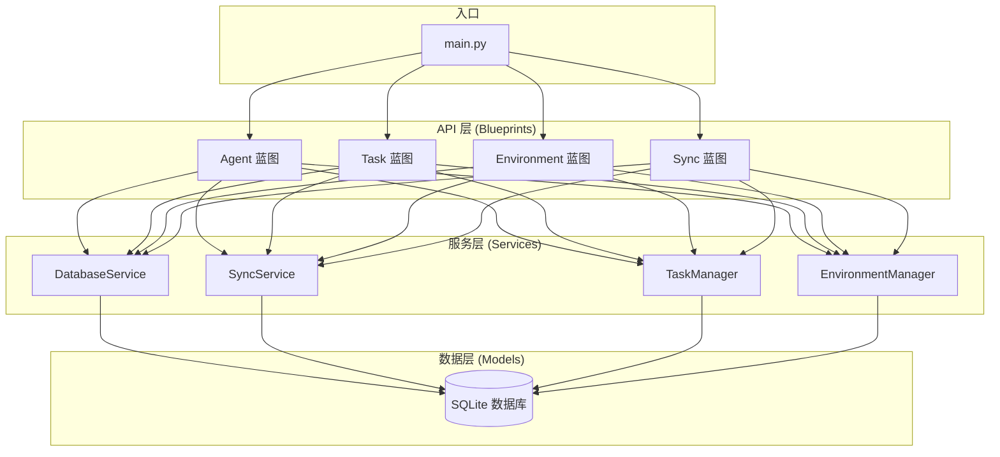
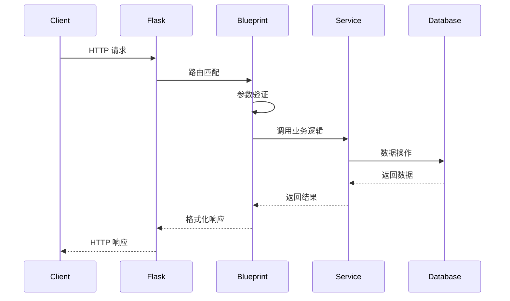
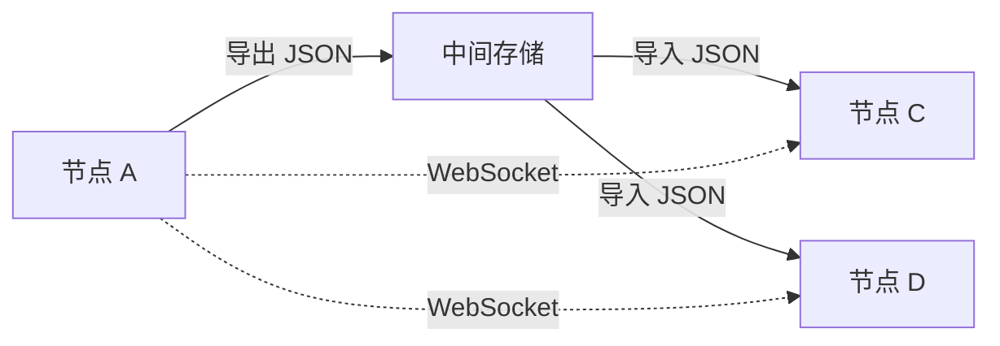

# Star Office UI - 系统架构文档

## 1. 系统架构概览

### 1.1 架构概述

Star Office UI 是一个基于 Flask 的后台管理系统，用于管理 AI 智能体、任务和运行环境。系统采用经典的**三层架构**设计，实现关注点分离和代码可维护性。



### 1.2 三层架构说明

#### API 层 (Blueprints)
- **职责**: 处理 HTTP 请求，参数验证，响应格式化
- **特点**: 无业务逻辑，仅做路由和参数处理
- **模式**: Flask Blueprint 模式

#### 服务层 (Services)
- **职责**: 核心业务逻辑，数据操作，跨模型协调
- **特点**: 可测试，可复用，与框架解耦
- **模式**: 服务类模式

#### 数据层 (Models)
- **职责**: 数据定义，数据库操作，数据验证
- **特点**: 使用 SQLAlchemy ORM
- **模式**: 数据模型模式

### 1.3 蓝图模式说明

Flask Blueprint 允许将应用模块化，每个功能模块独立开发和维护：

```python
# 蓝图定义示例
from flask import Blueprint

agent_bp = Blueprint('agent', __name__, url_prefix='/api/agents')

@agent_bp.route('/', methods=['GET'])
def list_agents():
    """获取所有智能体列表"""
    pass
```

## 2. 目录结构说明

```
star-office-ui/
├── backend/
│   ├── __init__.py
│   ├── main.py                 # 应用工厂入口
│   ├── api/                    # API 蓝图层
│   │   ├── __init__.py
│   │   ├── agents.py           # 智能体管理接口
│   │   ├── tasks.py            # 任务管理接口
│   │   ├── environments.py     # 环境管理接口
│   │   └── sync.py             # 同步接口
│   ├── services/               # 业务逻辑层
│   │   ├── __init__.py
│   │   ├── database.py         # 数据库服务
│   │   ├── sync.py             # 同步服务
│   │   ├── task_manager.py     # 任务管理器
│   │   └── environment.py      # 环境管理器
│   ├── models/                 # 数据模型层
│   │   ├── __init__.py
│   │   ├── agent.py            # 智能体模型
│   │   ├── task.py             # 任务模型
│   │   └── environment.py      # 环境模型
│   ├── utils/                  # 工具函数
│   │   ├── __init__.py
│   │   ├── helpers.py          # 通用辅助函数
│   │   └── validators.py       # 数据验证
│   └── scripts/                # 管理脚本
│       ├── init_db.py          # 初始化数据库
│       └── migrate.py          # 数据库迁移
├── frontend/                   # 前端代码（如有）
├── tests/                      # 测试文件
├── requirements.txt            # 依赖清单
└── ARCHITECTURE.md            # 本文档
```

### 2.1 backend/ 目录结构

```
backend/
├── main.py              # Flask 应用工厂
├── config.py           # 配置文件
└── app/
    ├── __init__.py     # 应用初始化
    ├── api/            # 路由层
    ├── services/       # 业务层
    ├── models/         # 数据层
    └── utils/          # 工具层
```

### 2.2 api/ 蓝图模块

| 文件 | 功能 | 路由前缀 |
|------|------|---------|
| `agents.py` | 智能体 CRUD | `/api/agents` |
| `tasks.py` | 任务 CRUD | `/api/tasks` |
| `environments.py` | 环境 CRUD | `/api/environments` |
| `sync.py` | 数据同步 | `/api/sync` |

### 2.3 services/ 业务逻辑层

| 服务 | 功能 |
|------|------|
| `DatabaseService` | 数据库连接、会话管理 |
| `SyncService` | 多节点数据同步 |
| `TaskManager` | 任务调度、状态管理 |
| `EnvironmentManager` | 环境配置、生命周期管理 |

### 2.4 models/ 数据模型

| 模型 | 描述 |
|------|------|
| `Agent` | AI 智能体定义 |
| `Task` | 任务定义 |
| `Environment` | 运行环境定义 |

### 2.5 utils/ 工具函数

- `helpers.py`: 日期格式化、ID 生成、数据转换
- `validators.py`: 输入验证、数据校验

### 2.6 scripts/ 管理脚本

- `init_db.py`: 初始化数据库表结构
- `migrate.py`: 数据库迁移工具

## 3. 核心组件说明

### 3.1 main.py - 工厂模式

使用应用工厂模式创建 Flask 应用实例，便于测试和扩展：

```python
# backend/main.py
from flask import Flask
from flask_socketio import SocketIO
from backend.api import register_blueprints
from backend.services.database import DatabaseService

def create_app(config_name='default'):
    """应用工厂函数"""
    app = Flask(__name__)
    
    # 加载配置
    app.config.from_object(f'backend.config.{config_name}Config')
    
    # 初始化 SocketIO
    socketio = SocketIO(app, cors_allowed_origins="*")
    
    # 初始化数据库
    db = DatabaseService(app.config['DATABASE_URL'])
    db.init_app()
    
    # 注册蓝图
    register_blueprints(app)
    
    return app, socketio

# 运行入口
if __name__ == '__main__':
    app, socketio = create_app()
    socketio.run(app, host='0.0.0.0', port=5000, debug=True)
```

### 3.2 DatabaseService - 数据库服务

管理数据库连接和会话：

```python
# backend/services/database.py
from sqlalchemy import create_engine
from sqlalchemy.orm import sessionmaker, scoped_session
from backend.models import Base

class DatabaseService:
    def __init__(self, database_url):
        self.database_url = database_url
        self.engine = None
        self.Session = None
        
    def init_app(self):
        """初始化数据库引擎"""
        self.engine = create_engine(
            self.database_url,
            pool_pre_ping=True,
            pool_recycle=300
        )
        self.Session = scoped_session(sessionmaker(bind=self.engine))
        
    def get_session(self):
        """获取数据库会话"""
        return self.Session()
    
    def create_tables(self):
        """创建所有表"""
        Base.metadata.create_all(self.engine)
```

### 3.3 SyncService - 同步服务

处理多节点数据同步：

```python
# backend/services/sync.py
import json
from datetime import datetime
from backend.services.database import DatabaseService

class SyncService:
    def __init__(self, db_service: DatabaseService):
        self.db = db_service
        
    def export_data(self):
        """导出数据为 JSON"""
        session = self.db.get_session()
        try:
            data = {
                'agents': [agent.to_dict() for agent in session.query(Agent).all()],
                'tasks': [task.to_dict() for task in session.query(Task).all()],
                'environments': [env.to_dict() for env in session.query(Environment).all()],
                'exported_at': datetime.utcnow().isoformat()
            }
            return json.dumps(data, ensure_ascii=False)
        finally:
            session.close()
            
    def import_data(self, data_json):
        """导入 JSON 数据"""
        data = json.loads(data_json)
        session = self.db.get_session()
        try:
            # 实现导入逻辑
            for agent_data in data.get('agents', []):
                agent = Agent(**agent_data)
                session.add(agent)
            session.commit()
            return True
        except Exception as e:
            session.rollback()
            raise e
        finally:
            session.close()
```

### 3.4 TaskManager - 任务管理器

管理任务的创建、执行和状态：

```python
# backend/services/task_manager.py
from backend.models.task import Task
from backend.models.task import TaskStatus
from backend.services.database import DatabaseService

class TaskManager:
    def __init__(self, db_service: DatabaseService):
        self.db = db_service
        
    def create_task(self, name, agent_id, config=None):
        """创建新任务"""
        session = self.db.get_session()
        try:
            task = Task(
                name=name,
                agent_id=agent_id,
                config=config or {},
                status=TaskStatus.PENDING
            )
            session.add(task)
            session.commit()
            return task
        finally:
            session.close()
            
    def get_task(self, task_id):
        """获取任务"""
        session = self.db.get_session()
        try:
            return session.query(Task).filter(Task.id == task_id).first()
        finally:
            session.close()
            
    def update_status(self, task_id, status):
        """更新任务状态"""
        session = self.db.get_session()
        try:
            task = session.query(Task).filter(Task.id == task_id).first()
            if task:
                task.status = status
                session.commit()
                return True
            return False
        finally:
            session.close()
```

### 3.5 EnvironmentManager - 环境管理器

管理运行环境的配置和生命周期：

```python
# backend/services/environment.py
from backend.models.environment import Environment
from backend.services.database import DatabaseService

class EnvironmentManager:
    def __init__(self, db_service: DatabaseService):
        self.db = db_service
        
    def create_environment(self, name, config):
        """创建新环境"""
        session = self.db.get_session()
        try:
            env = Environment(name=name, config=config)
            session.add(env)
            session.commit()
            return env
        finally:
            session.close()
            
    def list_environments(self):
        """获取所有环境"""
        session = self.db.get_session()
        try:
            return session.query(Environment).all()
        finally:
            session.close()
            
    def delete_environment(self, env_id):
        """删除环境"""
        session = self.db.get_session()
        try:
            env = session.query(Environment).filter(Environment.id == env_id).first()
            if env:
                session.delete(env)
                session.commit()
                return True
            return False
        finally:
            session.close()
```

## 4. 数据流说明

### 4.1 请求处理流程



### 4.2 数据持久化流程

```python
# 数据持久化示例
def save_agent(name, config):
    """保存智能体到数据库"""
    session = db.get_session()
    try:
        # 1. 创建模型实例
        agent = Agent(name=name, config=config)
        
        # 2. 添加到会话
        session.add(agent)
        
        # 3. 提交事务
        session.commit()
        
        # 4. 刷新获取 ID
        session.refresh(agent)
        
        return agent.id
    except Exception as e:
        # 5. 错误时回滚
        session.rollback()
        raise e
    finally:
        # 6. 关闭会话
        session.close()
```

### 4.3 同步机制



同步流程：
1. **主动同步**: 通过 `SyncService.export_data()` 导出数据
2. **被动同步**: 通过 `SyncService.import_data()` 导入数据
3. **实时同步**: 通过 WebSocket 推送变更

## 5. 技术栈

### 5.1 核心框架

| 技术 | 版本 | 用途 |
|------|------|------|
| Python | 3.9+ | 编程语言 |
| Flask | 2.3+ | Web 框架 |
| Flask-SocketIO | 5.3+ | WebSocket 支持 |
| SQLAlchemy | 2.0+ | ORM 框架 |
| SQLite | 3.x | 数据库 |

### 5.2 数据模型

#### Agent 模型

```python
# backend/models/agent.py
from sqlalchemy import Column, Integer, String, Text, DateTime
from backend.models.base import Base
from datetime import datetime

class Agent(Base):
    __tablename__ = 'agents'
    
    id = Column(Integer, primary_key=True, autoincrement=True)
    name = Column(String(100), nullable=False)
    description = Column(Text)
    config = Column(Text)  # JSON 格式
    created_at = Column(DateTime, default=datetime.utcnow)
    updated_at = Column(DateTime, default=datetime.utcnow, onupdate=datetime.utcnow)
    
    def to_dict(self):
        """转换为字典"""
        return {
            'id': self.id,
            'name': self.name,
            'description': self.description,
            'config': self.config,
            'created_at': self.created_at.isoformat(),
            'updated_at': self.updated_at.isoformat()
        }
```

#### Task 模型

```python
# backend/models/task.py
from sqlalchemy import Column, Integer, String, Text, DateTime, ForeignKey
from backend.models.base import Base
from datetime import datetime

class TaskStatus:
    PENDING = 'pending'
    RUNNING = 'running'
    COMPLETED = 'completed'
    FAILED = 'failed'

class Task(Base):
    __tablename__ = 'tasks'
    
    id = Column(Integer, primary_key=True, autoincrement=True)
    name = Column(String(100), nullable=False)
    agent_id = Column(Integer, ForeignKey('agents.id'))
    config = Column(Text)
    status = Column(String(20), default=TaskStatus.PENDING)
    result = Column(Text)
    created_at = Column(DateTime, default=datetime.utcnow)
    updated_at = Column(DateTime, default=datetime.utcnow, onupdate=datetime.utcnow)
```

#### Environment 模型

```python
# backend/models/environment.py
from sqlalchemy import Column, Integer, String, Text, DateTime
from backend.models.base import Base
from datetime import datetime

class Environment(Base):
    __tablename__ = 'environments'
    
    id = Column(Integer, primary_key=True, autoincrement=True)
    name = Column(String(100), nullable=False)
    description = Column(Text)
    config = Column(Text)  # JSON 格式
    active = Column(Integer, default=1)
    created_at = Column(DateTime, default=datetime.utcnow)
    updated_at = Column(DateTime, default=datetime.utcnow, onupdate=datetime.utcnow)
```

### 5.3 依赖安装

```bash
pip install flask flask-socketio sqlalchemy
```

## 6. 扩展指南

### 6.1 如何添加新的 API 端点

#### 步骤 1: 在对应蓝图中添加路由

```python
# backend/api/agents.py
from flask import Blueprint, request, jsonify
from backend.services.task_manager import TaskManager

agent_bp = Blueprint('agent', __name__, url_prefix='/api/agents')

@agent_bp.route('/<int:agent_id>/tasks', methods=['POST'])
def create_agent_task(agent_id):
    """为智能体创建任务"""
    data = request.get_json()
    task_manager = TaskManager(db_service)
    
    task = task_manager.create_task(
        name=data['name'],
        agent_id=agent_id,
        config=data.get('config', {})
    )
    
    return jsonify(task.to_dict()), 201
```

#### 步骤 2: 注册蓝图

```python
# backend/api/__init__.py
def register_blueprints(app):
    from backend.api.agents import agent_bp
    from backend.api.tasks import task_bp
    # 添加新蓝图
    app.register_blueprint(agent_bp)
    app.register_blueprint(task_bp)
```

### 6.2 如何添加新的服务

#### 步骤 1: 创建服务类

```python
# backend/services/report.py
class ReportService:
    def __init__(self, db_service):
        self.db = db_service
        
    def generate_task_report(self, start_date, end_date):
        """生成任务报告"""
        session = self.db.get_session()
        try:
            tasks = session.query(Task).filter(
                Task.created_at >= start_date,
                Task.created_at <= end_date
            ).all()
            return {'total': len(tasks), 'tasks': [t.to_dict() for t in tasks]}
        finally:
            session.close()
```

#### 步骤 2: 在 API 中使用

```python
# backend/api/reports.py
from backend.services.report import ReportService

@report_bp.route('/tasks', methods=['GET'])
def get_task_report():
    report_service = ReportService(db_service)
    report = report_service.generate_task_report(
        start_date=request.args['start'],
        end_date=request.args['end']
    )
    return jsonify(report)
```

### 6.3 如何添加新的数据模型

#### 步骤 1: 定义模型

```python
# backend/models/log.py
from sqlalchemy import Column, Integer, String, Text, DateTime
from backend.models.base import Base
from datetime import datetime

class Log(Base):
    __tablename__ = 'logs'
    
    id = Column(Integer, primary_key=True, autoincrement=True)
    level = Column(String(20))  # INFO, WARNING, ERROR
    message = Column(Text)
    context = Column(Text)  # JSON 格式
    created_at = Column(DateTime, default=datetime.utcnow)
    
    def to_dict(self):
        return {
            'id': self.id,
            'level': self.level,
            'message': self.message,
            'context': self.context,
            'created_at': self.created_at.isoformat()
        }
```

#### 步骤 2: 在 __init__.py 中注册

```python
# backend/models/__init__.py
from backend.models.base import Base
from backend.models.agent import Agent
from backend.models.task import Task
from backend.models.environment import Environment
from backend.models.log import Log  # 添加新模型
```

#### 步骤 3: 创建表

```python
# backend/scripts/init_db.py
from backend.main import create_app

app, _ = create_app()
with app.app_context():
    db.create_tables()
```

## 附录

### A. 环境配置

```python
# backend/config.py
import os

class Config:
    DATABASE_URL = os.environ.get('DATABASE_URL', 'sqlite:///star_office.db')
    SECRET_KEY = os.environ.get('SECRET_KEY', 'dev-key')
    SOCKET_IO_ASYNC_MODE = 'threading'

class DevelopmentConfig(Config):
    DEBUG = True

class ProductionConfig(Config):
    DEBUG = False
```

### B. 快速启动

```bash
# 1. 安装依赖
pip install -r requirements.txt

# 2. 初始化数据库
python backend/scripts/init_db.py

# 3. 启动服务
python backend/main.py
```

### C. 测试

```python
# tests/test_agent.py
import pytest
from backend.main import create_app

@pytest.fixture
def app():
    app, _ = create_app('development')
    app.config['TESTING'] = True
    return app

def test_create_agent(app):
    with app.test_client() as client:
        response = client.post('/api/agents', json={
            'name': 'Test Agent',
            'config': {}
        })
        assert response.status_code == 201
```

---

**文档版本**: 1.0  
**最后更新**: 2024 年  
**维护者**: Star Office UI 团队
